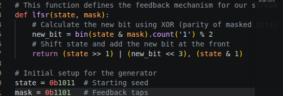
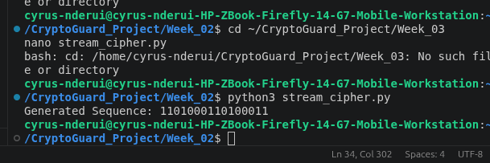
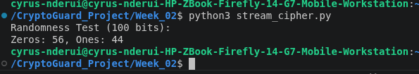
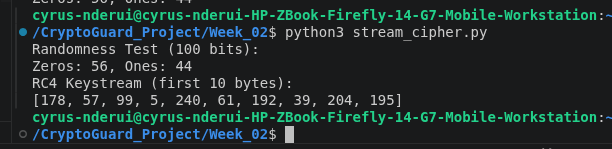
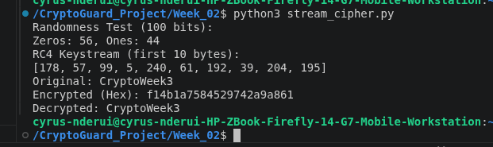

# Week 3: Stream Ciphers and Randomness Testing

## Title: Implementation of Stream Cipher Systems and Random Sequence Analysis

## Required Evidence

**Fig 1: LFSR Generator Implementation**

**Fig 2: Pseudorandom Sequence Output**

**Fig 3: Statistical Randomness Testing**

**Fig 4: RC4 Stream Cipher Simulation**

**Fig 5: Encryption Performance Results**

## Student Reflection
Randomness is the foundation of unpredictability in cryptography. Stream ciphers operate by XORing plaintext with a pseudorandom keystream. I performed frequency testing to verify sequence distribution. Effective pseudorandom generation is critical, as any detectable patterns in the keystream allow for trivial decryption, rendering the encryption scheme entirely insecure.