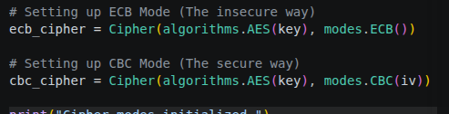
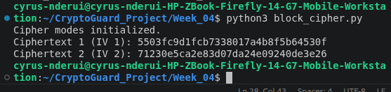
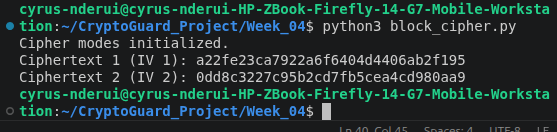
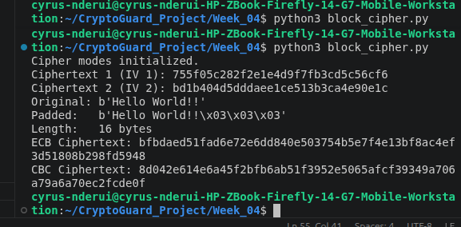
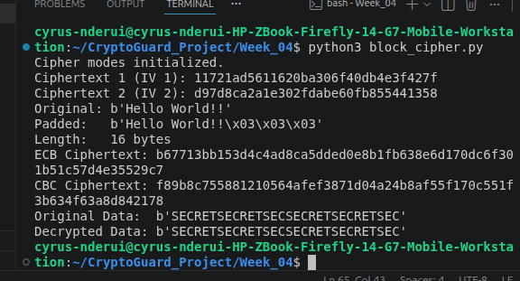

# Week 4: Block Ciphers and Modes of Operation

## Title: Analysis and Simulation of Block Cipher Modes

## Required Evidence

**Fig 1: Block Cipher Encryption Logic (ECB vs CBC)**

**Fig 2: Initialization Vector (IV) Implementation**

**Fig 3: Padding Scheme Demonstration**

**Fig 4: Ciphertext Pattern Comparison**

**Fig 5: Decryption Success Results**

## Student Reflection
Block ciphers process data in fixed-size chunks, necessitating padding for non-aligned inputs. Modes like CBC utilize an Initialization Vector (IV) to ensure identical plaintext blocks produce unique ciphertext, preventing the pattern analysis vulnerabilities found in ECB mode. I validated this by comparing ciphertext outputs and verifying integrity.